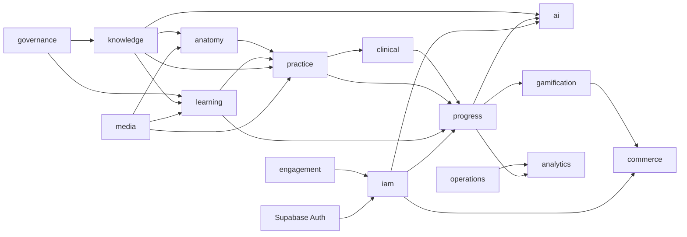
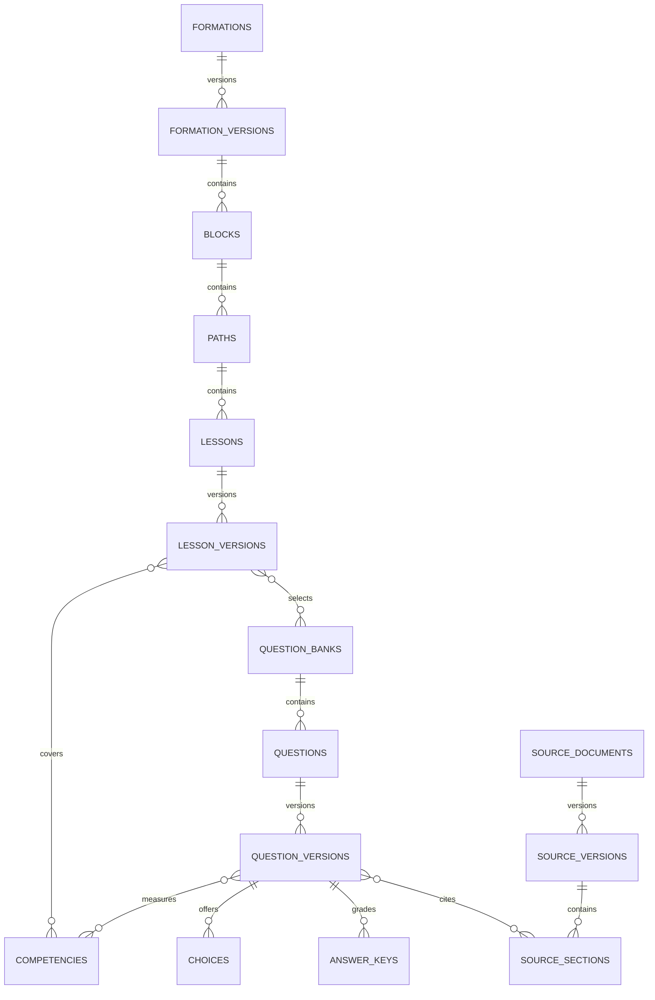
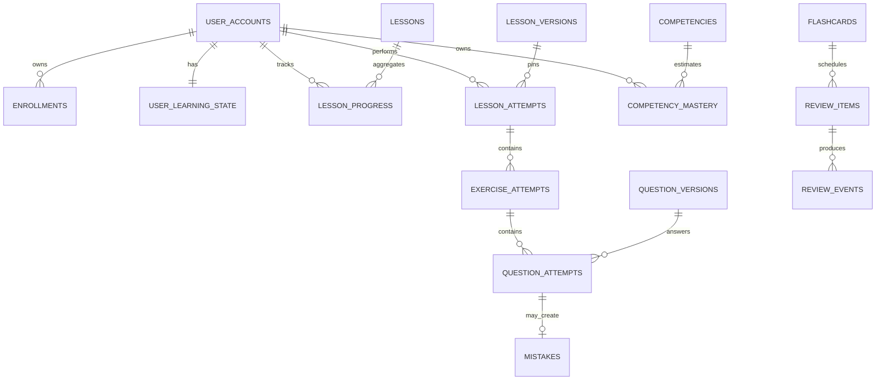
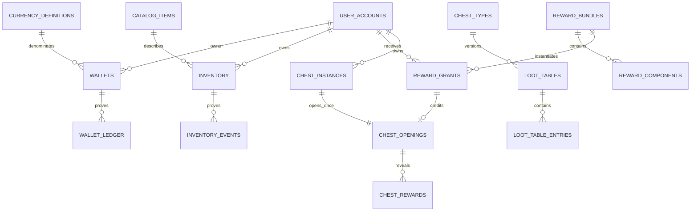
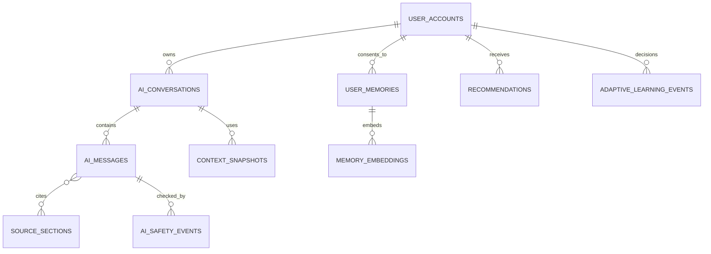

# Relations et diagrammes ERD

Le dictionnaire exhaustif des relations et cardinalités se trouve dans
[TABLE_CATALOG.md](TABLE_CATALOG.md). Les diagrammes ci-dessous montrent les
agrégats structurants ; afficher 195 tables dans un seul diagramme le rendrait
illisible et non vérifiable.

## Carte des contextes

## Contenu et banque pédagogique

## Progression et SRS

## Économie, récompenses et coffres

## Pulse IA

