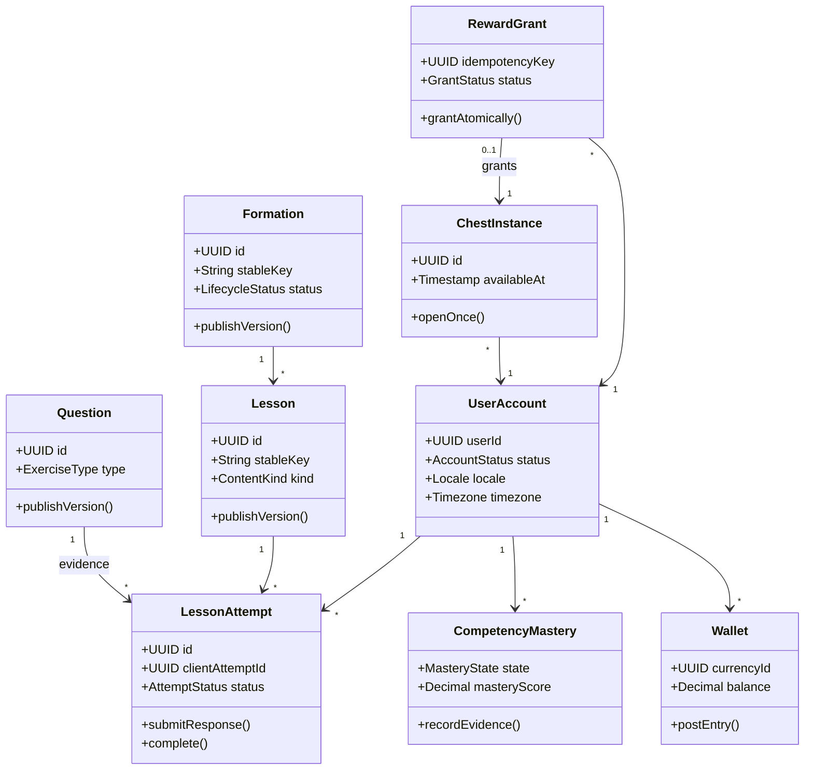
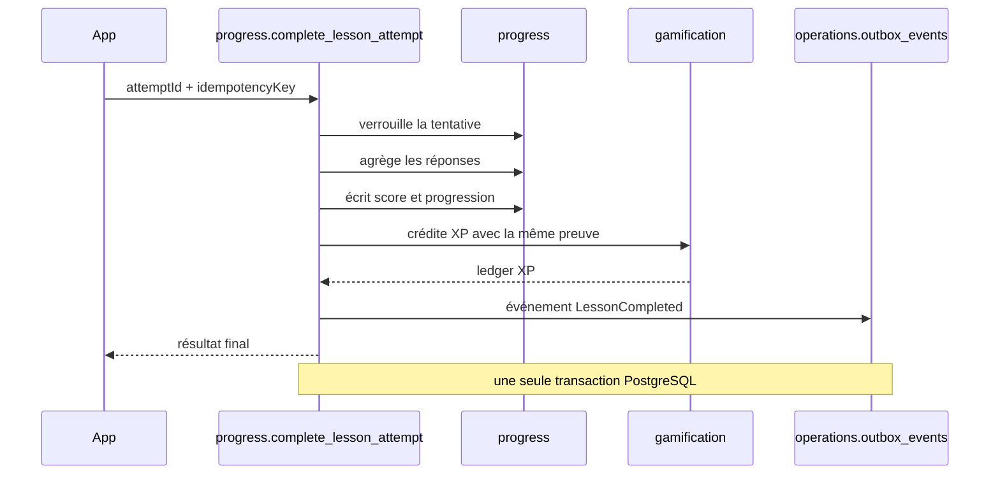
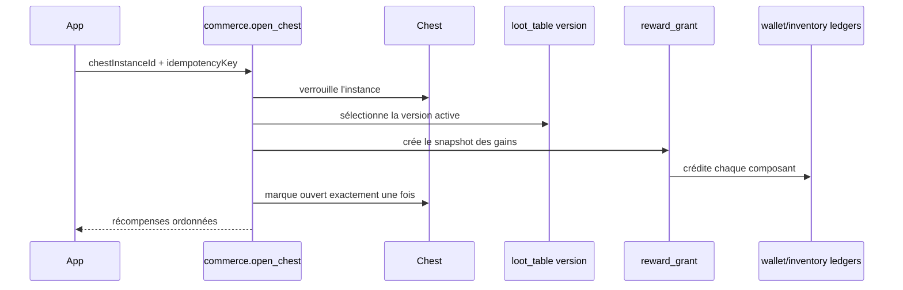
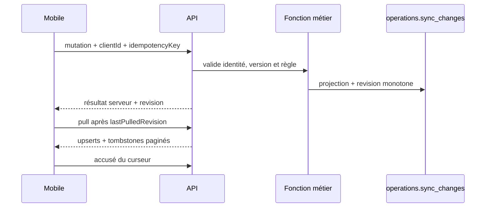

# Diagrammes UML

## Agrégats principaux

```mermaid
classDiagram
  class UserAccount {
    +UUID userId
    +AccountStatus status
    +Locale locale
    +Timezone timezone
  }
  class Formation {
    +UUID id
    +String stableKey
    +LifecycleStatus status
    +publishVersion()
  }
  class Lesson {
    +UUID id
    +String stableKey
    +ContentKind kind
    +publishVersion()
  }
  class Question {
    +UUID id
    +ExerciseType type
    +publishVersion()
  }
  class LessonAttempt {
    +UUID id
    +UUID clientAttemptId
    +AttemptStatus status
    +submitResponse()
    +complete()
  }
  class CompetencyMastery {
    +MasteryState state
    +Decimal masteryScore
    +recordEvidence()
  }
  class Wallet {
    +UUID currencyId
    +Decimal balance
    +postEntry()
  }
  class RewardGrant {
    +UUID idempotencyKey
    +GrantStatus status
    +grantAtomically()
  }
  class ChestInstance {
    +UUID id
    +Timestamp availableAt
    +openOnce()
  }

  UserAccount "1" --> "*" LessonAttempt
  Formation "1" --> "*" Lesson
  Lesson "1" --> "*" LessonAttempt
  Question "1" --> "*" LessonAttempt : evidence
  UserAccount "1" --> "*" CompetencyMastery
  UserAccount "1" --> "*" Wallet
  RewardGrant "*" --> "1" UserAccount
  ChestInstance "*" --> "1" UserAccount
  RewardGrant "0..1" --> "1" ChestInstance : grants
```

## Fin de leçon atomique

```mermaid
sequenceDiagram
  participant App
  participant RPC as progress.complete_lesson_attempt
  participant Attempt as progress
  participant XP as gamification
  participant Outbox as operations.outbox_events

  App->>RPC: attemptId + idempotencyKey
  RPC->>Attempt: verrouille la tentative
  RPC->>Attempt: agrège les réponses
  RPC->>Attempt: écrit score et progression
  RPC->>XP: crédite XP avec la même preuve
  XP-->>RPC: ledger XP
  RPC->>Outbox: événement LessonCompleted
  RPC-->>App: résultat final
  Note over RPC,Outbox: une seule transaction PostgreSQL
```

## Ouverture d'un coffre

```mermaid
sequenceDiagram
  participant App
  participant RPC as commerce.open_chest
  participant Chest
  participant Loot as loot_table version
  participant Reward as reward_grant
  participant Ledger as wallet/inventory ledgers

  App->>RPC: chestInstanceId + idempotencyKey
  RPC->>Chest: verrouille l'instance
  RPC->>Loot: sélectionne la version active
  RPC->>Reward: crée le snapshot des gains
  Reward->>Ledger: crédite chaque composant
  RPC->>Chest: marque ouvert exactement une fois
  RPC-->>App: récompenses ordonnées
```

## Synchronisation offline

```mermaid
sequenceDiagram
  participant Mobile
  participant API
  participant Domain as Fonction métier
  participant Feed as operations.sync_changes

  Mobile->>API: mutation + clientId + idempotencyKey
  API->>Domain: valide identité, version et règle
  Domain->>Feed: projection + revision monotone
  API-->>Mobile: résultat serveur + revision
  Mobile->>API: pull après lastPulledRevision
  API-->>Mobile: upserts + tombstones paginés
  Mobile->>API: accusé du curseur
```

